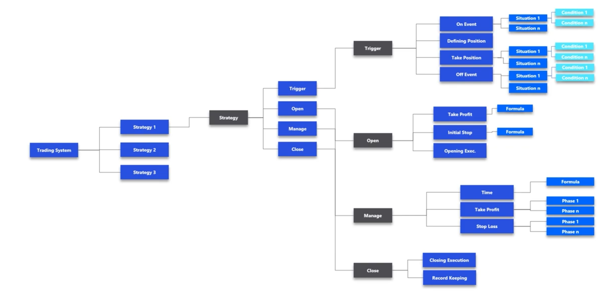

# Defining a Framework:

## Trading system
- made up of trading strategies

## Trading Strategies
- Idealy have multiple
- Has a trigger, open, manage, and close

### Trigger
1. Happens on Event (There can be multiple conditions)
   - Situation is defined by multiple conditions happening
2. Defining Position
3. Take Position (uses situation framework)
4. Off Event (uses situation framework)

### Open

1. Take Profit
   - uses multiple formulas
     - variable to change
     - some examples of formulas include profit margin, capital invested, sharpe ratio, etc.
2. Initial Stop
   - uses indicators like risk tolerance, market volatility, etc
3. Opening Execution
   - How you execute the open
### Manage
1. Time - use a formula (ie. Monte Carlo) or can be a fixed amount of time you want to be in a trade
2. Take Profit - can have phases
3. Stop profit
### Close
1. Closing execution
   - how to execute a closing of a position
2. Record Keeping
   - So that you can backtest and learn from what you have learned
   - Data collection in the database

# Goal of Bot
Purpose of bot(s) is to trade using strategies such as:
1. Technical analysis (indicators like MACD, RSI)
2. Fundamental analysis (earnings, P/E ratios)
3. Machine learning (price prediction)
4. Quantitative strategies (statistical arbitrage, momentum, mean reversion)

Using Python for analysis (hardware cannot support HFT) and trading

